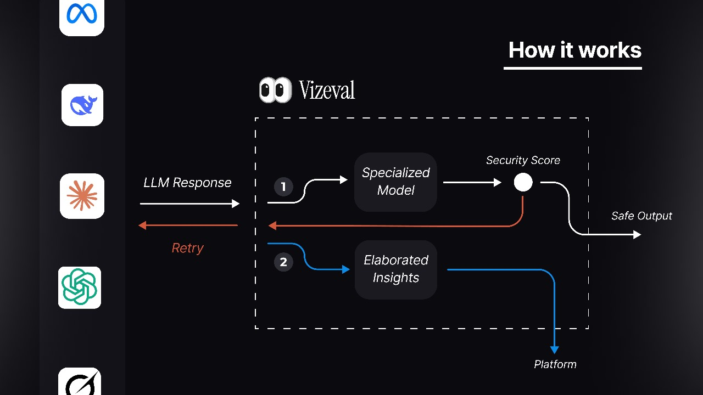

# VizEval API

VizEval is an API service designed to evaluate AI model responses with two primary purposes:

1. Serve the VizEval SDKs to evaluate requests with our specialized evaluators
2. Provide PASTA (Proprietary Advanced Safety Testing & Analysis) evaluations for our platform

## Architecture Overview

VizEval employs a two-stage evaluation approach:

1. **Fast Evaluation**: A proprietary, domain-specific model that quickly assesses responses and provides a risk score from 0 to 1
2. **Detailed Evaluation**: An asynchronous, more robust analysis using a fine-tuned version of Gemma Shield that provides in-depth insights about model behavior and responses

## Evaluation Flow

<div align="center">
    
</div>    

## Integration

VizEval can be integrated into your AI applications through:

1. **Direct API calls**: Use the REST API endpoints
2. **SDK Integration**: Import and use our client libraries
3. **Platform Dashboard**: Monitor and analyze evaluations through our web interface

## Deployment

The service can be deployed using Docker:

```bash
docker build -t vizeval .
docker run -p 8000:8000 vizeval
```

## Security and Performance

- All API requests require authentication via API key
- Fast evaluations typically complete in under 500ms
- Detailed analyses are processed asynchronously to maintain API responsiveness
- Results are stored securely and accessible only to authorized users

## Development

To set up a development environment:

1. Clone the repository
2. Install dependencies: `pip install -e .[tests]`
3. Run tests: `pytest`
4. Start development server: `python src/vizeval/main.py`